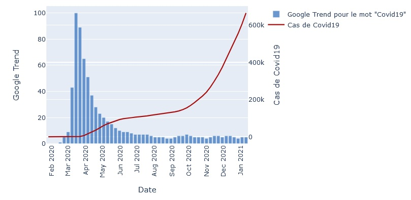

# Pascal Tremblay-Dauphinais
## [Coronavirus_search_correlation](https://github.com/PascalTremblayDauphinais/Coronavirus_search_correlation)
- Outil de visualisation du lien etnre les cas de Covid19 et les recherches par Google pour le terme Covid19
- Utilise la librairie pytrend pour extraire les données de Google Trend
- Utilise l'API Coronavirus COVID19 API
- Site construit en utilisant le framework Django
- Hébergé sur [Render](https://coronavirus-search-correlation.herokuapp.com/](https://coronavirus-search-correlation.onrender.com)

